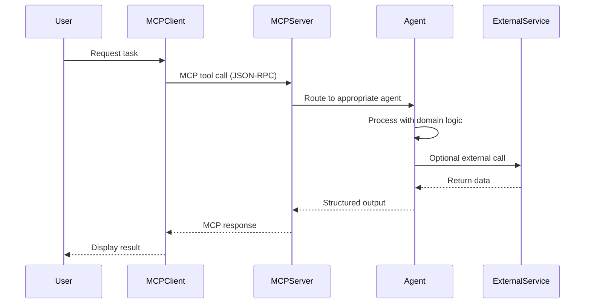

# 🧬 NerdCabalMCP Server Guide
### The Co-Scientist Platform for Granular Agent Control

```
███╗   ██╗███████╗██████╗ ██████╗      ██████╗ █████╗ ██████╗  █████╗ ██╗
████╗  ██║██╔════╝██╔══██╗██╔══██╗    ██╔════╝██╔══██╗██╔══██╗██╔══██╗██║
██╔██╗ ██║█████╗  ██████╔╝██║  ██║    ██║     ███████║██████╔╝███████║██║
██║╚██╗██║██╔══╝  ██╔══██╗██║  ██║    ██║     ██╔══██║██╔══██╗██╔══██║██║
██║ ╚████║███████╗██║  ██║██████╔╝    ╚██████╗██║  ██║██████╔╝██║  ██║███████╗
╚═╝  ╚═══╝╚══════╝╚═╝  ╚═╝╚═════╝      ╚═════╝╚═╝  ╚═╝╚═════╝ ╚═╝  ╚═╝╚══════╝
```

> **A modular MCP server implementing 14 specialized AI agents for research operations, security, design, and organizational governance.**

---

## 📚 Table of Contents

- [What is NerdCabalMCP?](#what-is-nerdcabalmcp)
- [Core Philosophy](#core-philosophy)
- [The 14 Agent Team](#the-14-agent-team)
- [Quick Start](#quick-start)
- [Installation](#installation)
- [Configuration](#configuration)
- [Running the MCP Server](#running-the-mcp-server)
- [Using Agents](#using-agents)
- [Architecture](#architecture)
- [API Reference](#api-reference)
- [Advanced Usage](#advanced-usage)
- [Troubleshooting](#troubleshooting)

---

## 🤔 What is NerdCabalMCP?

**NerdCabalMCP** is a Model Context Protocol (MCP) server that provides a **co-scientist platform** for AI-assisted research, operations, and creative work. Think of it as your personal team of 14 specialized AI experts, each with deep domain knowledge and the ability to collaborate seamlessly.

### Key Features

- **🧠 14 Specialized Agents**: From financial planning to neural forensics
- **🔗 A2A Protocol Compliant**: Agent-to-Agent communication following Anthropic Design Kit standards
- **🏗️ Modular Architecture**: Each agent is independently deployable and upgradeable
- **🔐 Security-First**: Built-in CISO agent with STRIDE threat modeling
- **📊 Production-Ready**: TypeScript implementation with full type safety
- **🌐 Multi-Platform**: Integrates with Claude Desktop, Streamlit, HuggingFace Spaces, and more

---

## 💡 Core Philosophy

### The Co-Scientist Model

Traditional AI tools give you one-size-fits-all assistants. NerdCabalMCP gives you **granular control** over specialized agent personas, allowing you to:

1. **Compose Custom Teams**: Mix and match agents for your specific workflow
2. **Iterate on Agent Design**: Each agent has clear capabilities and constraints
3. **Scale Intelligently**: Add new agents as your needs evolve
4. **Maintain Context**: Agents share knowledge through the MCP protocol

### Design Principles

- **Educational First**: Every agent is documented to teach, not just execute
- **Transparency**: Clear input/output schemas and reasoning traces
- **Modularity**: Each agent is a standalone module with minimal dependencies
- **Extensibility**: Built on open standards (MCP, A2A, ADK)

---

## 👥 The 14 Agent Team

### 🔬 Research & Evaluation

#### 1. **LLM-Rubric Architect**
**Role**: Evaluation Framework Designer
**Expertise**: Creates comprehensive rubrics for LLM evaluation, benchmark design, and quality criteria

**Use Cases**:
- Designing evaluation frameworks for new AI capabilities
- Creating rubrics for human evaluation of model outputs
- Generating benchmark specifications

**Example**:
```json
{
  "tool": "llm-rubric-architect",
  "task": "Create a rubric for evaluating code generation models",
  "criteria": ["correctness", "efficiency", "readability", "security"],
  "output_format": "markdown"
}
```

#### 2. **Experimental Designer**
**Role**: Research Methodology Specialist
**Expertise**: Hypothesis formulation, experimental design, statistical power analysis

**Use Cases**:
- Planning A/B tests for model improvements
- Designing controlled experiments for capability evaluations
- Generating research protocols for novel AI techniques

**Example**:
```json
{
  "tool": "experimental-designer",
  "research_question": "Does chain-of-thought improve math reasoning?",
  "constraints": {
    "budget": 1000,
    "timeframe": "2 weeks"
  }
}
```

#### 12. **Forensic Analyst**
**Role**: Neural Forensics Specialist
**Expertise**: DSMMD taxonomy (Data, Semantics, Methods, Metadata, Discourse)

**Use Cases**:
- Detecting confabulation patterns in LLM outputs
- Identifying context collapse and metadata leakage
- Analyzing transcripts for hallucination types

---

### 💰 Financial & Operations

#### 3. **Budget Agent**
**Role**: Financial Strategist
**Expertise**: Grant budgets, investor projections, ROI analysis

**Use Cases**:
- Creating grant application budgets (NIH, NSF, etc.)
- Generating investor pitch financial models
- Optimizing compute spend for ML training

**Example**:
```json
{
  "tool": "budget-agent",
  "project": "Language Model Training",
  "funding_target": 500000,
  "timeline_months": 18
}
```

#### 4. **The Comptroller**
**Role**: Operations Manager
**Expertise**: Iron Triangle optimization (Speed ⟷ Cost ⟷ Quality)

**Use Cases**:
- Calculating burn rate and runway
- Optimizing resource allocation across projects
- Generating sprint capacity planning

**Key Concept**: **The Iron Triangle**
```
      SPEED
       /  \
      /    \
     /  ⚖️  \
    /________\
  COST      QUALITY
```
You can optimize two, but not all three simultaneously.

---

### 🏛️ Governance & Security

#### 5. **The Administrator**
**Role**: Organizational Architect
**Expertise**: SOPs, team structures, timezone optimization

**Use Cases**:
- Designing org charts for distributed teams
- Creating standard operating procedures
- Optimizing meeting schedules across timezones

#### 8. **The CISO**
**Role**: Chief Information Security Officer
**Expertise**: STRIDE threat modeling, Zero Trust architecture

**Use Cases**:
- Security audits of AI systems
- Generating incident response playbooks
- Threat modeling for API deployments

**STRIDE Framework**:
- **S**poofing
- **T**ampering
- **R**epudiation
- **I**nformation Disclosure
- **D**enial of Service
- **E**levation of Privilege

---

### 🤖 ML Operations & Data

#### 6. **MLflow MCP Agent**
**Role**: Experiment Tracking Specialist
**Expertise**: MLflow queries, trace analysis, run comparisons

**Use Cases**:
- Querying experiment results across runs
- Generating comparative analysis of model versions
- Tracking hyperparameter optimization

#### 7. **Dataset Builder**
**Role**: Training Data Engineer
**Expertise**: SFT, DPO, HuggingFace dataset creation

**Use Cases**:
- Creating supervised fine-tuning datasets
- Generating DPO (Direct Preference Optimization) pairs
- Publishing datasets to HuggingFace Hub

**Supported Formats**:
- Supervised Fine-Tuning (SFT)
- Direct Preference Optimization (DPO)
- Reward Modeling (RM)
- Reinforcement Learning from Human Feedback (RLHF)

#### 11. **Visual Inspector**
**Role**: Data Quality Analyst
**Expertise**: FiftyOne visualization, mistakenness detection

**Use Cases**:
- Visualizing computer vision datasets
- Identifying label errors and edge cases
- Generating quality reports for training data

---

### 🎨 Design & Creative

#### 10. **Creative Director**
**Role**: Design Systems Architect
**Expertise**: Color theory, typography, CSS frameworks, UI/UX

**Use Cases**:
- Creating design systems for applications
- Generating color palettes with WCAG compliance
- Designing component libraries

**Supported Styles**:
- Cyberpunk Brutalist Bauhaus (your preferred aesthetic!)
- Material Design
- Tailwind CSS utility-first
- Custom design tokens

**Example**:
```json
{
  "tool": "creative-director",
  "style": "cyberpunk-brutalist-bauhaus",
  "colors": ["black", "white", "red"],
  "components": ["buttons", "cards", "navigation"]
}
```

---

### 🧩 Meta-Agents & Infrastructure

#### 9. **The Orchestrator**
**Role**: Multi-Agent Coordinator
**Expertise**: ADK patterns (Sequential, Parallel, Loop, Coordinator)

**Use Cases**:
- Composing multi-agent workflows
- Optimizing agent execution patterns
- Generating A2A communication protocols

**ADK Patterns**:
```
Sequential: A → B → C
Parallel:   A ⊕ B ⊕ C → Merge
Loop:       A → B → [condition] → A
Coordinator: A ⟷ C ⟷ B
```

#### 13-14. **Paper2Agent Infrastructure**
**Role**: Agent Lifecycle Management
**Expertise**: Creating, deploying, and monitoring agents

**Use Cases**:
- Converting research papers to executable agents
- Managing agent deployments
- Monitoring agent health and performance

---

## 🚀 Quick Start

### Prerequisites

- **Node.js** 18+ (we use v22.0.0)
- **npm** or **pnpm**
- **Claude Desktop** (for MCP client) or any MCP-compatible client

### 5-Minute Setup

```bash
# 1. Clone the repository
git clone https://github.com/Tuesdaythe13th/NerdCabalMCP.git
cd NerdCabalMCP

# 2. Install dependencies
cd mcp-server
npm install

# 3. Build the TypeScript code
npm run build

# 4. Configure Claude Desktop
# Add to ~/Library/Application Support/Claude/claude_desktop_config.json (macOS)
# or %APPDATA%/Claude/claude_desktop_config.json (Windows)
```

```json
{
  "mcpServers": {
    "nerdcabal": {
      "command": "node",
      "args": [
        "/absolute/path/to/NerdCabalMCP/mcp-server/dist/index.js"
      ],
      "env": {}
    }
  }
}
```

```bash
# 5. Restart Claude Desktop
# Your 14 agents are now available!
```

---

## 📦 Installation

### Detailed Installation Steps

#### Step 1: System Requirements

Verify your system meets the requirements:

```bash
# Check Node.js version (need 18+)
node --version  # Should show v18.x.x or higher

# Check npm
npm --version

# Install pnpm (optional, but faster)
npm install -g pnpm
```

#### Step 2: Clone and Setup

```bash
# Clone with all history
git clone https://github.com/Tuesdaythe13th/NerdCabalMCP.git
cd NerdCabalMCP

# Or clone with shallow history (faster)
git clone --depth 1 https://github.com/Tuesdaythe13th/NerdCabalMCP.git
cd NerdCabalMCP
```

#### Step 3: Install Dependencies

```bash
cd mcp-server

# Using npm
npm install

# Or using pnpm (faster)
pnpm install
```

**Dependencies Installed**:
- `@modelcontextprotocol/sdk` (v1.0.4): Core MCP protocol implementation
- `typescript` (v5.7.2): Type system and compiler
- `@types/node` (v22.0.0): Node.js type definitions

#### Step 4: Build the Project

```bash
# Full build
npm run build

# Development mode with auto-rebuild
npm run watch

# Development server with hot reload
npm run dev
```

**Build Output**: Compiled JavaScript files in `mcp-server/dist/`

#### Step 5: Verify Installation

```bash
# Test the server standalone
node dist/index.js

# You should see:
# MCP server running on stdio
```

---

## ⚙️ Configuration

### MCP Server Configuration

The server configuration is in `mcp-server/mcp-config.json`:

```json
{
  "server": {
    "name": "nerdcabal-mcp",
    "version": "1.0.0"
  },
  "tools": [
    {
      "name": "llm-rubric-architect",
      "enabled": true
    },
    {
      "name": "experimental-designer",
      "enabled": true
    }
    // ... all 14 agents
  ]
}
```

### Claude Desktop Configuration

#### macOS
Location: `~/Library/Application Support/Claude/claude_desktop_config.json`

```json
{
  "mcpServers": {
    "nerdcabal": {
      "command": "node",
      "args": [
        "/Users/yourname/NerdCabalMCP/mcp-server/dist/index.js"
      ],
      "env": {
        "LOG_LEVEL": "info"
      }
    }
  }
}
```

#### Windows
Location: `%APPDATA%\Claude\claude_desktop_config.json`

```json
{
  "mcpServers": {
    "nerdcabal": {
      "command": "node",
      "args": [
        "C:\\Users\\yourname\\NerdCabalMCP\\mcp-server\\dist\\index.js"
      ],
      "env": {}
    }
  }
}
```

#### Linux
Location: `~/.config/Claude/claude_desktop_config.json`

```json
{
  "mcpServers": {
    "nerdcabal": {
      "command": "node",
      "args": [
        "/home/yourname/NerdCabalMCP/mcp-server/dist/index.js"
      ],
      "env": {}
    }
  }
}
```

### Environment Variables

You can configure behavior with environment variables:

```bash
# Logging
LOG_LEVEL=debug|info|warn|error

# Agent-specific settings
MLFLOW_TRACKING_URI=http://localhost:5000
FIFTYONE_DATABASE_URI=mongodb://localhost:27017
```

---

## 🏃 Running the MCP Server

### Method 1: Claude Desktop (Recommended)

1. Configure `claude_desktop_config.json` as shown above
2. Restart Claude Desktop
3. Start a conversation and type `@` to see available tools
4. Select `nerdcabal` tools to use agents

### Method 2: Programmatic (Python)

```python
from anthropic import Anthropic
import json

client = Anthropic(api_key="your-api-key")

# Use the MCP tool
response = client.messages.create(
    model="claude-sonnet-4-5-20250929",
    max_tokens=4096,
    tools=[
        {
            "name": "llm-rubric-architect",
            "description": "Creates comprehensive evaluation rubrics",
            "input_schema": {
                "type": "object",
                "properties": {
                    "task": {"type": "string"},
                    "criteria": {"type": "array", "items": {"type": "string"}}
                },
                "required": ["task", "criteria"]
            }
        }
    ],
    messages=[
        {
            "role": "user",
            "content": "Create a rubric for evaluating code quality"
        }
    ]
)

print(response.content)
```

### Method 3: Streamlit UI (Coming Soon)

A cyberpunk brutalist bauhaus interface for easy agent interaction:

```bash
# Future command
streamlit run ui/app.py
```

### Method 4: HuggingFace Spaces (Coming Soon)

Deploy as a public or private space for team collaboration.

---

## 🎯 Using Agents

### Basic Usage Pattern

Every agent follows this pattern:

```
Input → Agent Processing → Output
```

1. **Input**: Structured JSON with task parameters
2. **Processing**: Agent applies domain expertise
3. **Output**: Structured result (JSON, Markdown, or Notebook)

### Example 1: Creating an Evaluation Rubric

**Goal**: Evaluate a chatbot's performance

**Input**:
```json
{
  "tool": "llm-rubric-architect",
  "task": "chatbot-evaluation",
  "dimensions": [
    "response_quality",
    "context_retention",
    "safety",
    "personality"
  ],
  "scale": "1-5",
  "output_format": "markdown"
}
```

**Output**:
```markdown
# Chatbot Evaluation Rubric

## Response Quality (1-5)
- **5**: Accurate, complete, directly addresses query
- **4**: Mostly accurate, minor gaps
- **3**: Partially correct, some misunderstandings
- **2**: Significant errors or irrelevance
- **1**: Completely wrong or nonsensical

## Context Retention (1-5)
...
```

### Example 2: Designing an Experiment

**Goal**: Test if prompt engineering improves accuracy

**Input**:
```json
{
  "tool": "experimental-designer",
  "hypothesis": "Chain-of-thought prompting increases accuracy on math problems",
  "baseline": "direct-answer",
  "intervention": "chain-of-thought",
  "metric": "accuracy",
  "sample_size": 1000
}
```

**Output**:
```markdown
# Experiment Design: Chain-of-Thought vs Direct Answer

## Hypothesis
H0: No difference in accuracy between methods
H1: Chain-of-thought produces higher accuracy

## Methodology
- **Design**: Between-subjects randomized controlled trial
- **Sample**: 1000 math problems (balanced across difficulty)
- **Groups**:
  - Control: Direct answer prompts (n=500)
  - Treatment: Chain-of-thought prompts (n=500)

## Power Analysis
- Effect size (expected): d=0.3
- Power: 0.80
- Alpha: 0.05
- Required n per group: 352 (achieved)

## Success Criteria
- p < 0.05 on two-tailed t-test
- Effect size d > 0.2 (small practical significance)
```

### Example 3: Security Audit

**Goal**: Threat model for an API

**Input**:
```json
{
  "tool": "ciso-agent",
  "system": "LLM API",
  "components": ["API gateway", "model inference", "user database"],
  "framework": "STRIDE"
}
```

**Output**:
```markdown
# STRIDE Threat Model: LLM API

## Component: API Gateway
### Spoofing
- **Threat**: Attacker impersonates legitimate user
- **Mitigation**: JWT with short expiration, API key rotation
- **Risk**: HIGH

### Tampering
- **Threat**: Request modification in transit
- **Mitigation**: HTTPS/TLS 1.3 only, request signing
- **Risk**: MEDIUM

...
```

### Example 4: Multi-Agent Workflow

**Goal**: Create a complete research project

**Input**:
```json
{
  "tool": "orchestrator",
  "workflow": {
    "pattern": "sequential",
    "agents": [
      {
        "name": "experimental-designer",
        "input": {"hypothesis": "..."}
      },
      {
        "name": "budget-agent",
        "input": {"project": "from_previous", "timeline": 6}
      },
      {
        "name": "administrator",
        "input": {"team_size": 3, "timeline": "from_previous"}
      }
    ]
  }
}
```

**Output**: Coordinates all three agents sequentially, passing context between them.

---

## 🏗️ Architecture

### High-Level Overview

```
┌─────────────────────────────────────────────────────┐
│                  MCP Client                         │
│         (Claude Desktop, Custom UI, etc.)           │
└────────────────────┬────────────────────────────────┘
                     │ MCP Protocol (JSON-RPC)
                     ▼
┌─────────────────────────────────────────────────────┐
│              NerdCabalMCP Server                    │
│                   (index.ts)                        │
├─────────────────────────────────────────────────────┤
│  Tool Router                                        │
│   ├─ llm-rubric-architect                          │
│   ├─ experimental-designer                         │
│   ├─ budget-agent                                  │
│   ├─ comptroller-agent                             │
│   ├─ administrator-agent                           │
│   ├─ mlflow-agent                                  │
│   ├─ dataset-builder                               │
│   ├─ ciso-agent                                    │
│   ├─ orchestrator                                  │
│   ├─ creative-director                             │
│   ├─ visual-inspector                              │
│   ├─ forensic-analyst                              │
│   └─ paper2agent-infrastructure (2 tools)          │
└────────────────────┬────────────────────────────────┘
                     │
                     ▼
┌─────────────────────────────────────────────────────┐
│            External Integrations                    │
│  ├─ MLflow (experiment tracking)                   │
│  ├─ FiftyOne (dataset visualization)               │
│  ├─ HuggingFace (dataset hosting)                  │
│  ├─ GitHub (repository analysis)                   │
│  └─ Google Colab (notebook execution)              │
└─────────────────────────────────────────────────────┘
```

### Agent Architecture (A2A/ADK Compliant)

Each agent implements the **Agent Card** specification:

```typescript
interface AgentCard {
  name: string;              // e.g., "llm-rubric-architect"
  version: string;           // Semantic versioning
  description: string;       // Human-readable purpose
  capabilities: string[];    // What the agent can do
  input_schema: JSONSchema;  // Structured input format
  output_schema: JSONSchema; // Structured output format
  dependencies: string[];    // Required external services
  adk_patterns: ADKPattern[]; // Supported execution patterns
}
```

**ADK Execution Patterns**:

```
1. Sequential: A → B → C
   Use when: Output of A is required input for B

2. Parallel: A ⊕ B ⊕ C
   Use when: Tasks are independent

3. Loop: A → [condition] → A or B
   Use when: Iterative refinement needed

4. Coordinator: A ⟷ C ⟷ B
   Use when: Central agent manages communication
```

### File Structure

```
mcp-server/src/
├── index.ts                  # Main MCP server (tool routing)
├── types.ts                  # TypeScript interfaces
├── utils.ts                  # Shared utilities
├── agents/
│   ├── rubric-architect.ts
│   ├── experimental-designer.ts
│   ├── budget-agent.ts
│   ├── comptroller-agent.ts
│   ├── administrator-agent.ts
│   ├── mlflow-agent.ts
│   ├── dataset-builder.ts
│   ├── ciso-agent.ts
│   ├── orchestrator.ts
│   ├── creative-director.ts
│   ├── visual-inspector.ts
│   └── forensic-analyst.ts
└── infrastructure/
    ├── create-agent.ts
    ├── check-agent.ts
    └── launch-mcp.ts
```

### Communication Flow



---

## 📖 API Reference

### Tool: `llm-rubric-architect`

**Purpose**: Generate evaluation rubrics for LLM capabilities

**Input Schema**:
```json
{
  "type": "object",
  "properties": {
    "task": {
      "type": "string",
      "description": "The evaluation task"
    },
    "dimensions": {
      "type": "array",
      "items": {"type": "string"},
      "description": "Aspects to evaluate"
    },
    "scale": {
      "type": "string",
      "enum": ["1-3", "1-5", "1-7", "1-10"],
      "default": "1-5"
    },
    "output_format": {
      "type": "string",
      "enum": ["markdown", "json", "csv"]
    }
  },
  "required": ["task", "dimensions"]
}
```

**Output**: Markdown rubric or JSON structure

---

### Tool: `experimental-designer`

**Purpose**: Design controlled experiments for AI research

**Input Schema**:
```json
{
  "type": "object",
  "properties": {
    "hypothesis": {
      "type": "string",
      "description": "Research hypothesis to test"
    },
    "baseline": {
      "type": "string",
      "description": "Control condition"
    },
    "intervention": {
      "type": "string",
      "description": "Treatment condition"
    },
    "metric": {
      "type": "string",
      "description": "Primary evaluation metric"
    },
    "sample_size": {
      "type": "integer",
      "minimum": 30
    },
    "constraints": {
      "type": "object",
      "properties": {
        "budget": {"type": "number"},
        "timeframe": {"type": "string"}
      }
    }
  },
  "required": ["hypothesis", "metric"]
}
```

**Output**: Experimental design document (Markdown)

---

### Tool: `budget-agent`

**Purpose**: Financial planning and budget generation

**Input Schema**:
```json
{
  "type": "object",
  "properties": {
    "project": {
      "type": "string",
      "description": "Project name/description"
    },
    "funding_target": {
      "type": "number",
      "description": "Target funding amount (USD)"
    },
    "timeline_months": {
      "type": "integer",
      "minimum": 1
    },
    "categories": {
      "type": "array",
      "items": {
        "type": "string",
        "enum": ["personnel", "compute", "equipment", "travel", "indirect"]
      }
    },
    "format": {
      "type": "string",
      "enum": ["NIH", "NSF", "investor_pitch", "generic"]
    }
  },
  "required": ["project", "funding_target", "timeline_months"]
}
```

**Output**: Detailed budget spreadsheet (JSON/CSV/Markdown)

---

### Tool: `orchestrator`

**Purpose**: Coordinate multi-agent workflows

**Input Schema**:
```json
{
  "type": "object",
  "properties": {
    "workflow": {
      "type": "object",
      "properties": {
        "pattern": {
          "type": "string",
          "enum": ["sequential", "parallel", "loop", "coordinator"]
        },
        "agents": {
          "type": "array",
          "items": {
            "type": "object",
            "properties": {
              "name": {"type": "string"},
              "input": {"type": "object"}
            }
          }
        }
      }
    }
  },
  "required": ["workflow"]
}
```

**Output**: Workflow execution plan and coordination strategy

---

### Tool: `creative-director`

**Purpose**: Design system and UI/UX generation

**Input Schema**:
```json
{
  "type": "object",
  "properties": {
    "style": {
      "type": "string",
      "enum": ["cyberpunk-brutalist-bauhaus", "material", "tailwind", "custom"]
    },
    "colors": {
      "type": "array",
      "items": {"type": "string"},
      "description": "Color palette (hex or named colors)"
    },
    "components": {
      "type": "array",
      "items": {
        "type": "string",
        "enum": ["buttons", "cards", "navigation", "forms", "typography"]
      }
    },
    "output_format": {
      "type": "string",
      "enum": ["css", "tailwind", "styled-components", "figma_tokens"]
    }
  },
  "required": ["style", "components"]
}
```

**Output**: Design system specification (CSS/JSON)

---

### Tool: `forensic-analyst`

**Purpose**: Neural forensics for LLM transcript analysis

**Input Schema**:
```json
{
  "type": "object",
  "properties": {
    "transcript": {
      "type": "string",
      "description": "LLM conversation transcript"
    },
    "taxonomy": {
      "type": "string",
      "enum": ["DSMMD"],
      "default": "DSMMD"
    },
    "detect": {
      "type": "array",
      "items": {
        "type": "string",
        "enum": [
          "confabulation",
          "context_collapse",
          "metadata_leakage",
          "semantic_drift",
          "method_confusion"
        ]
      }
    }
  },
  "required": ["transcript"]
}
```

**Output**: Forensics report with detected issues (Markdown/JSON)

---

## 🔥 Advanced Usage

### Custom Agent Development

Want to add your own agent? Here's the template:

```typescript
// mcp-server/src/agents/my-custom-agent.ts

import { AgentCard, AgentInput, AgentOutput } from '../types';

export const myCustomAgent: AgentCard = {
  name: 'my-custom-agent',
  version: '1.0.0',
  description: 'What your agent does',
  capabilities: [
    'capability-1',
    'capability-2'
  ],
  input_schema: {
    type: 'object',
    properties: {
      // Define your input structure
      task: { type: 'string' }
    },
    required: ['task']
  },
  output_schema: {
    type: 'object',
    properties: {
      result: { type: 'string' }
    }
  },
  dependencies: [],
  adk_patterns: ['sequential', 'parallel']
};

export async function executeMyCustomAgent(
  input: AgentInput
): Promise<AgentOutput> {
  // Your agent logic here

  return {
    success: true,
    data: {
      result: 'Agent output'
    }
  };
}
```

Then register it in `index.ts`:

```typescript
import { myCustomAgent, executeMyCustomAgent } from './agents/my-custom-agent';

server.setRequestHandler(CallToolRequestSchema, async (request) => {
  if (request.params.name === 'my-custom-agent') {
    const result = await executeMyCustomAgent(request.params.arguments);
    return { content: [{ type: 'text', text: JSON.stringify(result) }] };
  }
  // ... other agents
});
```

### Using with LangChain

```python
from langchain.agents import Tool
from langchain.llms import Anthropic
import requests

def call_nerdcabal_agent(agent_name: str, input_data: dict) -> str:
    """Call a NerdCabal MCP agent"""
    response = requests.post(
        'http://localhost:3000/mcp',
        json={
            'tool': agent_name,
            'input': input_data
        }
    )
    return response.json()

# Create LangChain tool
rubric_tool = Tool(
    name="Rubric Architect",
    func=lambda task: call_nerdcabal_agent('llm-rubric-architect', {'task': task}),
    description="Creates evaluation rubrics"
)

# Use in agent
from langchain.agents import initialize_agent, AgentType

agent = initialize_agent(
    tools=[rubric_tool],
    llm=Anthropic(model='claude-3-opus-20240229'),
    agent=AgentType.STRUCTURED_CHAT_ZERO_SHOT_REACT_DESCRIPTION
)

result = agent.run("Create a rubric for evaluating chatbot empathy")
```

### Using with LangFlow

Import the `nerdcabal-langflow.json` configuration:

```json
{
  "nodes": [
    {
      "type": "MCPTool",
      "data": {
        "server": "nerdcabal",
        "tool": "llm-rubric-architect"
      }
    }
  ]
}
```

### Using with Anthropic Workbench

1. Open Anthropic Workbench
2. Go to Tools → Add MCP Server
3. Point to your local NerdCabal server
4. All 14 agents appear as tools

---

## 🛠️ Troubleshooting

### Issue: "MCP server not found"

**Solution**:
1. Verify `claude_desktop_config.json` path is correct
2. Ensure you used **absolute paths**, not relative
3. Restart Claude Desktop completely (quit and reopen)
4. Check logs: `~/Library/Logs/Claude/mcp*.log` (macOS)

### Issue: "Module not found" errors

**Solution**:
```bash
cd mcp-server
rm -rf node_modules package-lock.json
npm install
npm run build
```

### Issue: Agent not responding

**Solution**:
1. Check agent is enabled in `mcp-config.json`
2. Verify input matches the required schema
3. Check server logs for errors:
```bash
LOG_LEVEL=debug node dist/index.js
```

### Issue: TypeScript compilation errors

**Solution**:
```bash
# Update TypeScript
npm install -D typescript@latest

# Clear build cache
rm -rf dist/
npm run build
```

### Issue: External service integration failing

**Solutions**:

**MLflow**:
```bash
# Start MLflow server
mlflow server --host 0.0.0.0 --port 5000

# Set environment variable
export MLFLOW_TRACKING_URI=http://localhost:5000
```

**FiftyOne**:
```bash
# Start FiftyOne app
fiftyone app launch

# Verify database
fiftyone migrate --info
```

**HuggingFace**:
```bash
# Login to HuggingFace
huggingface-cli login

# Verify token
huggingface-cli whoami
```

---

## 🎓 Educational Resources

### Understanding MCP

**Model Context Protocol (MCP)** is Anthropic's standard for connecting AI models to external tools and data sources.

**Key Concepts**:
- **Server**: Provides tools (your NerdCabal agents)
- **Client**: Uses tools (Claude Desktop, your app)
- **Protocol**: JSON-RPC over stdio or HTTP
- **Tools**: Functions the model can call

**Learn More**:
- [MCP Documentation](https://modelcontextprotocol.io)
- [Anthropic MCP Guide](https://docs.anthropic.com/claude/docs/mcp)

### Understanding A2A Protocol

**Agent-to-Agent (A2A)** protocol enables structured communication between AI agents.

**Key Concepts**:
- **Agent Card**: Metadata describing agent capabilities
- **Input Schema**: Structured request format
- **Output Schema**: Structured response format
- **Handshake**: Capability negotiation between agents

### Understanding ADK Patterns

**Anthropic Design Kit (ADK)** provides patterns for multi-agent workflows.

**Pattern Details**:

1. **Sequential**: A → B → C
   - Use when output of A is input to B
   - Example: Design → Budget → Timeline

2. **Parallel**: A ⊕ B ⊕ C → Merge
   - Use when tasks are independent
   - Example: Multiple code reviews simultaneously

3. **Loop**: A → [condition] → A or B
   - Use for iterative refinement
   - Example: Draft → Review → Revise → Review

4. **Coordinator**: A ⟷ C ⟷ B
   - Use when central agent manages state
   - Example: Orchestrator coordinates specialist agents

---

## 🔗 Integration Guides

### Streamlit Integration

```python
import streamlit as st
import requests

st.title("🧬 NerdCabal MCP Interface")

agent = st.selectbox("Select Agent", [
    "llm-rubric-architect",
    "experimental-designer",
    "budget-agent",
    "creative-director"
])

if agent == "creative-director":
    style = st.selectbox("Style", [
        "cyberpunk-brutalist-bauhaus",
        "material",
        "tailwind"
    ])
    colors = st.multiselect("Colors", ["black", "white", "red", "blue"])

    if st.button("Generate Design System"):
        result = requests.post('http://localhost:3000/mcp', json={
            'tool': agent,
            'input': {'style': style, 'colors': colors}
        })
        st.code(result.json()['data'], language='css')
```

### HuggingFace Spaces Integration

Create `app.py` in your Space:

```python
import gradio as gr
from anthropic import Anthropic

client = Anthropic()

def call_agent(agent_name, task_description):
    response = client.messages.create(
        model="claude-sonnet-4-5-20250929",
        max_tokens=4096,
        tools=[{"name": f"nerdcabal:{agent_name}"}],
        messages=[{"role": "user", "content": task_description}]
    )
    return response.content[0].text

iface = gr.Interface(
    fn=call_agent,
    inputs=[
        gr.Dropdown(["llm-rubric-architect", "experimental-designer"], label="Agent"),
        gr.Textbox(label="Task Description")
    ],
    outputs=gr.Markdown(),
    title="NerdCabal MCP Agents"
)

iface.launch()
```

### Replit Integration

Create `.replit` file:

```toml
run = "npm run dev"
language = "nodejs"

[nix]
channel = "stable-22_11"

[deployment]
deploymentTarget = "cloudrun"
```

---

## 📊 Performance & Monitoring

### Metrics

Each agent tracks:
- **Latency**: P50, P95, P99 response times
- **Error Rate**: Failed requests per minute
- **Usage**: Requests per agent per day

### Logging

```bash
# Enable debug logging
LOG_LEVEL=debug node dist/index.js 2>&1 | tee mcp-server.log

# View agent-specific logs
grep "llm-rubric-architect" mcp-server.log

# Monitor real-time
tail -f mcp-server.log | grep ERROR
```

### Health Checks

```bash
# Test server is responding
curl -X POST http://localhost:3000/mcp \
  -H "Content-Type: application/json" \
  -d '{"method": "health"}'

# Should return: {"status": "ok", "agents": 14}
```

---

## 🤝 Contributing

We welcome contributions! See our contributing guide for:
- Adding new agents
- Improving existing agents
- Enhancing documentation
- Reporting bugs

**Quick Contribution**:
```bash
git checkout -b feature/my-new-agent
# Make your changes
npm run build
npm test
git commit -m "Add: My new agent for X"
git push origin feature/my-new-agent
# Open a pull request
```

---

## 📜 License

MIT License - see LICENSE file for details

---

## 🙏 Acknowledgments

- **Anthropic** for the MCP protocol and Claude models
- **Google DeepMind** for co-scientist model inspiration
- The open-source AI community for agent design patterns

---

## 📧 Support

- **Documentation**: You're reading it!
- **Issues**: [GitHub Issues](https://github.com/Tuesdaythe13th/NerdCabalMCP/issues)
- **Discussions**: [GitHub Discussions](https://github.com/Tuesdaythe13th/NerdCabalMCP/discussions)

---

**Built with ❤️ by the NerdCabal community**

```
End of MCP Server Guide
Last Updated: January 2026
Version: 1.0.0
```
